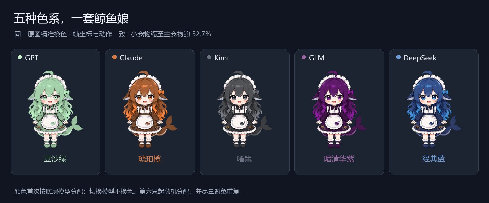

# 鲸鱼娘多会话版 · DSH Session Pet

独立维护的 DSH 插件：`@ltmroberthk915/dsh-pet`。本项目 fork 自 [zhu1090093659/dsh-pet](https://github.com/zhu1090093659/dsh-pet)，沿用 Apache-2.0 许可证及原素材署名；改动由 ltmroberthk915 维护。



## 功能

- 每个活跃顶层会话一个宠物；当前对话使用主大小，其他为 52.7%，不弹气泡。
- 按底层模型首次分配豆沙绿 GPT、橙色 Claude、黑色 Kimi、暗紫 GLM、蓝色 DeepSeek；中途换模型不换色。
- 向右跑步可用固定 FPS、素材原速或 `FPS = clamp(k × tok/s + b, 1, 60)`；每只跟随自己对话底栏统计。
- 后台完成的小宠物保留等待查看；打开对话就变为主宠物，不需要输入。前台查看后，切走时回收。
- 所有宠物共享累计喂食、亲密度及小鱼干；大小、字号、拖动、命名和设置保存继续可用。
- 桌面适配器支持独立透明窗口、主窗口最小化后继续显示、跨屏自由拖动和避让；采用事件触发布局和空闲低频动画。

## 安装与更新

下载预构建的 [GitHub Release](https://github.com/ltmroberthk915/dsh-pet/releases/latest)，或在 DSH 外部终端运行：

```sh
dsh plugin --profile desktop add https://github.com/ltmroberthk915/dsh-pet/releases/latest/download/dsh-session-pet.tgz
```

Web 宿主使用自己的 web profile。安装前备份 DSH 数据，并移除或停用旧 `@linxin666/dsh-pet` 的加载声明；两版共用宠物服务，不能同时启用。升级时只从此仓库的 Release 更新；不要安装原作者同名旧包覆盖本 fork。配置继续使用 `pet` 行及原养成数据。

包内包含编译好的 host/client 与素材，无安装脚本，不会在安装时改动宿主。普通安装使用页面内宠物。**独立桌面窗口需要额外的宿主适配**：当前仅验证 DSH Desktop 0.2.0-rc.2 的指定归档，先退出 DSH 并备份原 app.asar，再使用包内 `desktop/patch-desktop.cjs` 输出新归档；不支持的版本会拒绝。已接入此适配器的本地用户保留该能力。详见[桌面接入、行为和限制](docs/desktop-refined-pet.md)。

## 开发

```sh
pnpm install --frozen-lockfile --ignore-scripts
pnpm prepare
pnpm typecheck
pnpm build:local
```

本发布验证 599 项源码检查与 50 项隔离 Electron 检查；Windows 符号链接权限及未打包旧形象的测试限制在桌面说明中列出。待查看状态随宿主会话生命周期存在，退出程序后不恢复旧活动。

## 来源

[原项目](https://github.com/zhu1090093659/dsh-pet)提供基础框架、素材和交互。此 fork 增加会话级桌面伴侣、配色、调速、回收规则、安全修复与调度优化。见 [LICENSE](LICENSE) 与 [NOTICE](NOTICE)。

v1.0.3：明确宠物在任务栏之上的层级，外部激活导致取消置顶时按事件恢复；电脑控制连续拉起已置顶的 DSH 主窗口时，宠物仍优先显示。不抢键盘焦点，也不持续抬高空闲窗口。宠物标记为工具窗口，避免被电脑控制误认作 DSH 主窗口。鼠标离开、失焦与拖动中断统一处理，避免点击穿透与拖动后误触。

v1.0.1：思考、正文与其他工具参数生成向右跑；写文件、编辑、替换和补丁参数生成向左跑。两种生成动作共用可调 k、b，跟随所属会话底栏 tok/s；实际工具执行保留原速。鲸鱼娘独立语音包保留全部场景，每类精选 3 句。
